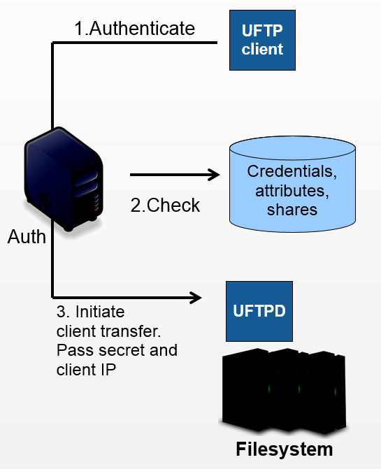

.. _authserver:

Auth Server
***********

The UFTP authentication service (**Auth server**) is RESTful
service for authenticating users and initiating UFTP transfers. It is indended to be used with 
a standalone UFTP client and provides access to one or more :ref:`UFTPD servers <uftpd>`.

Besides data transfer via UFTP and data management features like ``ls``, the Auth server also 
provides REST services for data sharing and accessing shared data sets.

The Auth server is based on the UNICORE Services Environment, and all usual UNICORE features and 
security configuration options are available as well. For example, the Auth server can be 
deployed behind a `UNICORE Gateway 
<https://unicore-docs.readthedocs.io/en/latest/admin-docs/gateway/>`__, or it can be configured 
to use `Unity <https://unity-idm.eu/>`__ for authenticating users.

.. topic:: Features

 * RESTful service
 * Authentication

   * SSH keys
   * Unity (OAuth token)
   * PAM
   * Username/password file
   * … (extensible)

 * Attribute mapping

   * UNIX uid, gid
   * QoS e.g. rate limit

|user-guide-img| :doc:`manual`
  Installation and Operating the Auth server.

  .. |user-guide-img| image:: ../../_static/user-guide.png
  	:height: 22px
  	:align: middle

|update-img| :doc:`upgrade`
  Upgrade the Auth server to this version.

.. |update-img| image:: ../../_static/update.png
	:height: 22px
	:align: middle

.. toctree::
	:maxdepth: 2
	:caption: Auth Server Documentation
	:hidden:

	manual
   	upgrade

