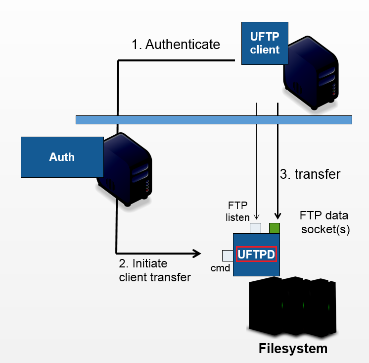

.. _uftpd:

UFTPD Server
************

The UFTPD server provides a high-performance data transfer based on passive FTP. 

The UFTP server listens on two ports (which may be on two different network interfaces):

* the command port receives control commands

* the listen port accepts data connections from clients

The UFTPD server is *controlled* by an :ref:`authserver` or `UNICORE/X
<https://unicore-docs.readthedocs.io/en/latest/admin-docs/unicorex/>`__ via the
command port, and receives/sends data directly from/to a client
machine (which can be an actual user client machine or another
server). 

.. topic:: Features

 * FTP-compliant data server running on a POSIX file system

 * Runs privileged on a server with access to the file systems to be served, 
   fully drops privileges to current user for all operations

 * Requires
   
   * Python 3.6 or later
   * Server certificate

 * Firewall requirements
   
   * Allow incoming connections to *listen* port (FTP port)
   * Enable FTP connection tracking OR open port range
   * Allow incoming connection to *control* port from :ref:`authserver`

|user-guide-img| :doc:`manual`
  Installation and Operating the UFTPD server.

.. toctree::
	:maxdepth: 5
	:caption: UFTPD Server Documentation
	:hidden:
	
	manual.rst

