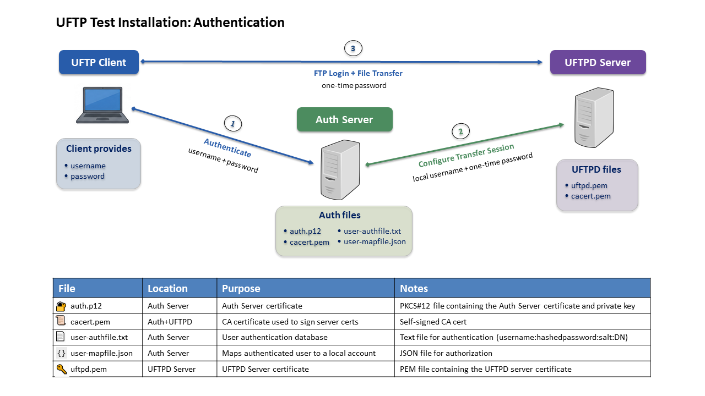

.. _uftp-howto-test:

|user-guide| How-To Install UFTP for Testing
********************************************

|overview-img| Overview
-----------------------

This guide explains how to set up a complete UFTP test environment
consisting of a UFTPD server, an Auth server, and a UFTP client using
the provided test certificates. All components can be installed on a
single machine, making the setup suitable for evaluation and functional
testing.

.. warning::
   This setup is intended **for testing only**. The included certificates
   are not suitable for production use. Production deployments must use
   certificates issued by a trusted Certificate Authority (CA).

|checklist-img| Prerequisites
-----------------------------

- Java 17 or later (OpenJDK recommended)

- Python 3.9 or later

- The UFTPD server *listening* port must be reachable through your firewall.
  If stateful firewall inspection is enabled, configure the port for FTP
  connection tracking. Alternatively, configure and open a fixed range of
  data ports.

- The UFTPD command port must be accessible from the Auth server.

- For encrypted data transfers, the Python *Crypto* module is required.
  It can be installed using:

  .. code:: console

     python3 -m pip install pycryptodome

|config-img| Installation and Configuration
-------------------------------------------

To set up a complete test environment, install the following components:

1. Install and run a UFTPD server as described in
   :ref:`UFTPD Server Installation <uftpd-test-installation>`.

2. Install and run an Auth server as described in
   :ref:`Auth Server Installation <authserver-test-installation>`.

3. Install the UFTP client as described in
   :ref:`UFTP Client Installation <uftpc-installation>`.

All components can be installed on the same machine for testing purposes.

Authentication and File Transfer Flow
-------------------------------------

In this setup, the UFTP client authenticates using only a username and
password. No client certificate is required.

The authentication and data transfer process works as follows:

1. The UFTP client sends the username and password to the Auth server
   via HTTPS.

2. The Auth server validates the credentials using the password file
   (``userdb.txt``) and maps the authenticated user to a local account using
   ``simpleuudb``.

3. If authentication succeeds, the Auth server replies with "OK" and a one-time password.

4. The UFTP client uses the one-time password to connect to the UFTPD server with the normal FTP protocol.

5. If the login is successful, the FTP session is started, allowing file transfers and other FTP operations.

Only the Auth server and the UFTPD server require certificates
(``auth.p12`` and ``uftpd.pem``).  
The client does not require a certificate. Authentication is performed
using only a username and password.

Testing the Installation
------------------------

To verify that the installation was successful, run the functional and
performance tests described in :ref:`uftpd_test`.

These tests use the UFTP client to connect to the Auth server and the
UFTPD server and verify authentication, file transfers, and performance.

Troubleshooting
---------------

Authentication failures
~~~~~~~~~~~~~~~~~~~~~~~

Check:

* username/password
* ``userdb.txt``
* Auth Server logs

ACL errors
~~~~~~~~~~

Check:

* ``conf/uftpd.acl``
* certificate DNs
* TLS trust configuration

Certificate trust problems
~~~~~~~~~~~~~~~~~~~~~~~~~~

Verify:

* ``conf/cacert.pem``
* certificate validity
* certificate subjects
* matching CA certificates

Permission denied errors
~~~~~~~~~~~~~~~~~~~~~~~~

Verify:

* Unix user exists
* directory permissions
* configured ``USER_NAME``

.. raw:: html

   
