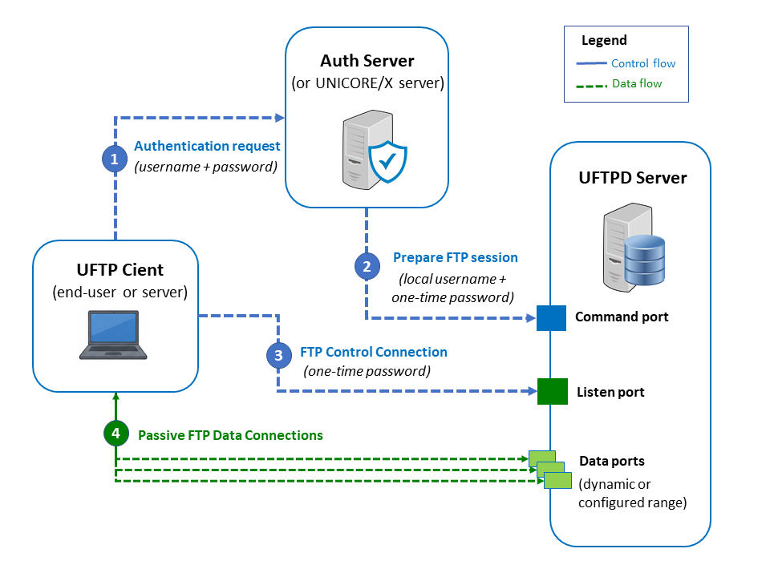

.. _uftp-howto-test:

|user-guide| How-To Install UFTP for Testing
********************************************

|overview-img| Overview
-----------------------

This guide explains how to set up a complete UFTP test environment
consisting of a UFTPD server, an Auth server, and a UFTP client using
the provided test certificates. All components can be installed on a
single machine, making the setup suitable for evaluation and functional
testing.

.. warning::
   This setup is intended **for testing only**. The included certificates
   are not suitable for production use. Production deployments must use
   certificates issued by **a trusted Certificate Authority (CA)**.

|checklist-img| Prerequisites
-----------------------------

- Java 17 or later (OpenJDK recommended)

- Python 3.9 or later

- The UFTPD server *listening* port must be reachable through your firewall.
  If stateful firewall inspection is enabled, configure the port for FTP
  connection tracking. Alternatively, configure and open a fixed range of
  data ports.

- The UFTPD command port must be accessible from the Auth server.

- For encrypted data transfers, the Python *Crypto* module is required.
  It can be installed using:

  .. code:: console

     python3 -m pip install pycryptodome

Authentication and File Transfer Flow
-------------------------------------

In this setup, the UFTP client authenticates using only a username and
password. No client certificate is required.

.. list-table::
   :header-rows: 1
   :widths: 20 22 28 30

   * - File
     - Location
     - Purpose
     - Notes
   * - 👤 ``user-authfile.txt``
     - Auth Server
     - User authentication database
     - Text file for authentication [username:hashedpassword:salt:DN]
   * - 👥 ``user-mapfile.json``
     - Auth Server
     - Maps authenticated user to a local account
     - JSON file for authorization
   * - ⚙️ ``container.properties``
     - Auth Server
     - Auth Server configuration
     - Text file containing the configuration for the Auth Server
   * - 🔐 ``auth.p12``
     - Auth Server
     - Auth Server certificate
     - PKCS#12 file containing the Auth Server certificate and private key
   * - 🛡️ ``cacert.pem``
     - Auth+UFTPD Servers
     - CA certificate used to sign server certs
     - Self-signed CA cert
   * - 🔐 ``uftpd.pem``
     - UFTPD Server
     - UFTPD Server certificate
     - PEM file containing the UFTPD server certificate
   * - ⚙️ ``uftpd.conf``
     - UFTPD Server
     - UFTPD Server configuration
     - Text file containing the configuration for the UFTPD Server
   * - 🔑 ``uftpd.acl``
     - UFTPD Server
     - Access Control List (ACL)
     - Text file containing the distinguished names (DNs) of servers authorized to initiate UFTP transfers
   * - 🔒 ``uftpd-ssl.conf``
     - UFTPD Server
     - UFTPD SSL/TLS configuration
     - Text file containing the SSL/TLS configuration, including the UFTPD credential and trusted CA certificate
	 
The authentication and file transfer process works as follows:

1. The client sends an authentication request containing its username and
   password to the Auth server. The Auth server validates the credentials
   using ``user-authfile.txt`` and maps the authenticated user to a local
   account using ``user-mapfile.json``.

2. If authentication is successful, the Auth server sends a request to the
   UFTPD command port. This request configures the upcoming file transfer and
   includes the following information:

   - a generated one-time password 

   - the local user ID and group ID 

   - the client's IP address

   The UFTPD server stores this information and accepts an incoming client
   connection only if the supplied one-time password matches the expected
   value. The Auth server then replies with ``OK`` and returns the generated
   one-time password to the client.

3. The UFTP client connects to the UFTPD server using the standard FTP
   protocol. It authenticates with the one-time password received from the 
   Auth server. 
   
4. Once authentication succeeds, the client can open data connections, 
   list files, transfer data, and perform other FTP operations.

|config-img| Installation and Configuration
-------------------------------------------

To set up a complete test environment, install the following components:

1. Install and run a UFTPD server as described in
   :ref:`UFTPD Server Installation <uftpd-test-installation>`.

2. Install and run an Auth server as described in
   :ref:`Auth Server Installation <authserver-test-installation>`.

3. Install the UFTP client as described in
   :ref:`UFTP Client Installation <uftpc-installation>`.

All components can be installed on the same machine for testing purposes.

.. _uftpd-test-installation:

UFTPD Installation using Test Certificates
~~~~~~~~~~~~~~~~~~~~~~~~~~~~~~~~~~~~~~~~~~

This guide describes how to install the UFTPD server using the **test
certificates** included in the distribution package.

1. Download the ``.tar.gz`` distribution from
   `GitHub <https://github.com/UNICORE-EU/uftpd/releases>`__.

2. Unpack the package in your installation directory:

   .. code:: console

      tar -xvf unicore-uftpd-<release>.tar.gz

3. **Check file permissions.** All files in the ``conf`` and ``lib``
   directories must be **readable** by the user specified as
   ``USER_NAME`` in :file:`conf/uftpd.conf`. The scripts in ``bin`` and
   all subdirectories must also be **executable** by this user.

   Ensure that a system user matching the configured ``USER_NAME``
   (for example, ``unicore``) exists. If necessary, edit the
   configuration to match your current system username.

4. Configure :file:`conf/uftpd-ssl.conf` to use the provided
   **test keystore and truststore**:

   .. code:: text

      credential.path=conf/uftpd.pem
      credential.password=the!uftpd
      truststore=conf/cacert.pem

   Ensure that the ``uftpd.pem`` and ``cacert.pem`` files are present
   in the ``conf`` directory. If they are missing, download them from
   the source package available on
   `GitHub <https://github.com/UNICORE-EU/uftpd/releases>`__.
   Unpack the ``.tar.gz`` or ``.zip`` package and check the ``test`` 
   directory for the files.

5. Start UFTPD as **root**:

   **Option 1: Run directly with sudo**

   .. code:: console

      sudo <uftpd-installation-dir>/bin/unicore-uftpd-start.sh

   **Option 2: Switch to a root shell**
   (recommended if logging to stdout; see Step 7.)

   .. code:: console

      sudo su -
      cd <uftpd-installation-dir>
      ./bin/unicore-uftpd-start.sh

6. **Verify server status.** You can check whether the server is
   running by invoking the status script, which displays the current
   status and PID:

   .. code:: console

      ./bin/unicore-uftpd-status.sh

   If successful, the output will show:

   ``UNICORE UFTPD running with PID xxxxxxx``.

7. **Logging (Optional).** Monitor the system logs to verify
   operation:

   .. code:: console

      sudo journalctl -f

   * **For detailed debugging:** Set ``export LOG_VERBOSE=true`` in
     :file:`conf/uftpd.conf`.

   * **To print logs to stdout:** Set ``export LOG_SYSLOG=false`` in
     :file:`conf/uftpd.conf`.

   .. important::

      If you disable syslog, the server might **fail to start** when
      using ``sudo``. This is because the process switches to the
      configured ``USER_NAME`` and may lose permission to write to the
      root terminal's stdout. To fix this, start the server from a real
      root shell (Option 2 in Step 5).

.. _authserver-test-installation:

Auth Server Installation using Test Certificates
~~~~~~~~~~~~~~~~~~~~~~~~~~~~~~~~~~~~~~~~~~~~~~~~

This guide describes how to install the Auth server using the **test** certificates 
included in the distribution package. 

1. Download the ``unicore-authserver-<release>.tar.gz`` file from 
   `GitHub <https://github.com/UNICORE-EU/uftp/releases>`__.

2. Unpack the package in your installation directory:

   .. code:: console

      tar -xvf unicore-authserver-<release>.tar.gz

   **Check file permissions.** All files must be **readable**, and all
   subdirectories and the scripts in the ``bin`` directory must be
   **executable** by the user running the Auth server (for example,
   the ``unicore`` user or your current account).

3. Configure :file:`conf/container.properties` to use the provided **test 
   keystore and truststore**:

   .. code:: text

      container.security.credential.path=certs/auth.p12
      container.security.credential.password=the!auth
      container.security.truststore.directoryLocations.1=certs/trusted-certs/*.pem
     
4. If your UFTPD server is running on a different host, configure this
   setting in :file:`conf/container.properties` to specify the publicly
   accessible hostname or IP address of the UFTPD server:

   .. code:: text

      authservice.server.TEST.host=<your-server-ip-address>

5. Edit ``user-mapfile.json`` to map the demo certificate to a local
   system account. Ensure that the ``xlogin`` value matches an existing
   local username (for example, ``unicore`` or your current username):

   .. code:: json

      {
        "CN=Demo User,O=UNICORE,C=EU": {
          "role":   "user",
          "xlogin": [ "unicore" ]
        }
      }

6. Start the Auth server:

   .. code:: console

      ./bin/unicore-authserver-start.sh

7. Check the server status:

   .. code:: console

      ./bin/unicore-authserver-status.sh

   The output should show: 
   ``UNICORE service AUTHSERVER running with PID xxxxxx``.

8. **Review the logs.** Check :file:`authserver-startup.log` and
   :file:`authserver.log` in the ``logs`` directory for startup
   messages and any errors.

9. **Verify using curl.** By default, the Auth server listens on
   **port 9000** (configured by ``container.port`` in
   ``container.properties``). If the server is running locally,
   execute:

   .. code:: console

      curl -k https://localhost:9000/rest/auth \
           -H "Accept: application/json" \
           -u demouser:test123

   This command should return a JSON document containing the status of the
   configured UFTPD servers.

Testing the Installation
------------------------

To verify that the installation was successful, run the functional and
performance tests described in :ref:`uftpd_test`.
These tests use the UFTP client to connect to the Auth server and the
UFTPD server and verify authentication, file transfers, and performance.

Troubleshooting
---------------

Authentication failures
~~~~~~~~~~~~~~~~~~~~~~~

Check:

* username/password
* ``conf/user-authfile.txt`` und ``conf/user-mapfile.json`` (mapping to a local account)
* Auth Server logs (``logs/authserver-startup.log`` and ``logs/authserver.log``)

ACL errors
~~~~~~~~~~

Check:

* certificate DNs in ``conf/uftpd.acl``

Certificate trust problems
~~~~~~~~~~~~~~~~~~~~~~~~~~

On the Auth Server, verify:
 
* ``certs/auth.p12`` 
* ``certs/trusted-certs/cacert.pem`` 

On the UFTPD Server, verify:

* ``conf/uftp-ssl.conf`` 
* ``conf/uftpd.pem`` 
* ``conf/cacert.pem`` 

Also verify:

* certificate validity 
* certificate subjects 
* matching CA certificates

Permission denied errors
~~~~~~~~~~~~~~~~~~~~~~~~

Verify:

* ``conf/uftpd.conf``
* directory permissions
* configured ``USER_NAME``
* Unix user exists

.. raw:: html

   
