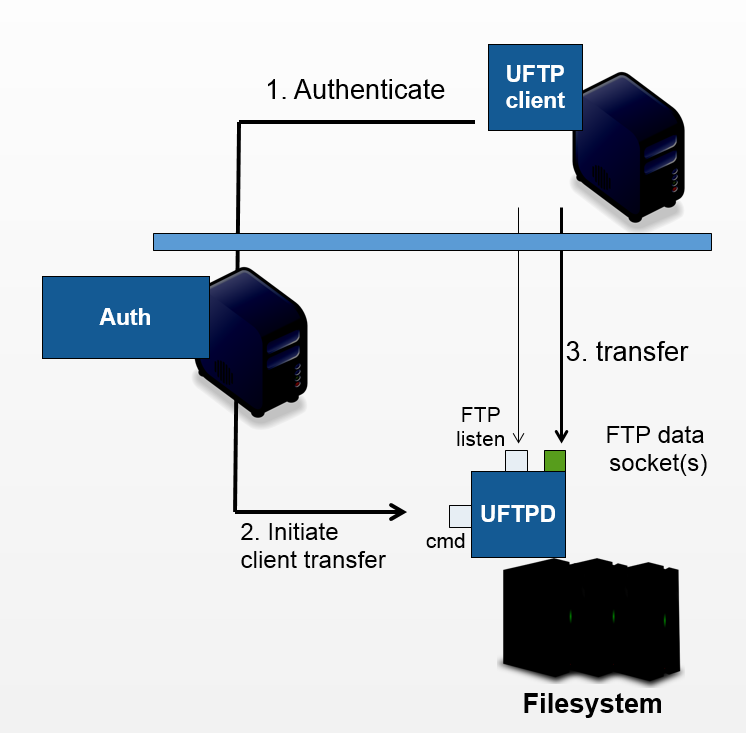

.. _uftp-overview:

|overview-img| UFTP Overview
****************************

UFTP (**U**\ NICORE **FTP**) is a file transfer tool similar to Unix FTP. Its main features 
include high-performance file transfers from client to server (and vice versa), list directories,  
make/remove files or directories, sync files and data sharing. In addition, users can easily 
share their data even with users who do not have Unix-level access to the data.

UFTP Features
~~~~~~~~~~~~~

- Based on the FTP protocol with separate authentication via RESTful APIs 

- Powerful :ref:`UFTP standalone client <uftp-client>` available

- Optional: multiple FTP sessions per client for large-scale transfers,
  encryption and compression of the data streams

- Flexible integration options (authentication, user mapping), firewall-friendly

- System requirements: client: Java 11+, server: Python3

UFTP Architecture
~~~~~~~~~~~~~~~~~

The UFTP file server, called :ref:`UFTPD <uftpd>`, listens on two ports (which may be on two 
different network interfaces):

- the command port receives control commands from the authentication server(s)

- the listen port accepts data connections from clients.

The UFTPD server is *controlled* by an :ref:`authserver` or :ref:`UNICORE/X
<unicore-docs:unicorex>` via the
command port, and receives/sends data directly from/to a client
machine (which can be an actual user client machine or another
server). The client, e.g. :ref:`uftp-client`, connnects to the *listen* port, which has to
be accessible from external machines. The client opens additional data connection(s) via the
passive FTP protocol.

How does UFTP work
~~~~~~~~~~~~~~~~~~

The sequence for a UFTP file transfer is as follows:
  
* the client (which can be an end-user client, or a service such as a :ref:`UNICORE/X server  
  <unicore-docs:unicorex>`) sends
  an authentication request to the :ref:`Auth server <authserver>` (or another UNICORE/X server)
   
* the Auth server sends a request to the command port of UFTPD. This request notifies the UFTPD 
  server about the upcoming transfer and contains the following information 
  
  - a *secret*, i.e. a one-time password which the client will use to authenticate itself
  - the user and group id which uftpd should use to access files
  - an optional key to encrypt/decrypt the data
  - the client's IP address
    
* the UFTPD server will now  accept an incoming client connection, provided the supplied 
  *secret* (one-time password) matches the expectation.
  
* if everything is OK, an FTP session is created, and the client can use the FTP protocol to 
  open data connections, list files, transfer data etc. Data connections are opened via 
  *passive FTP*, which allows the firewall to dynamically open the requested ports (which can 
  by any port, see below if you want to a fixed port range).
  
* for each UFTP session, UFTPD will fork a process which runs as the requested user (with the 
  requested primary group).

UFTP Applications and Use Cases
~~~~~~~~~~~~~~~~~~~~~~~~~~~~~~~

* Secure, high-performance data access/transfer

  * Powerful :ref:`UFTP commandline client <uftp-client>`
 
* Integrate data access/transfer functionality into web applications

  * RESTful APIs for authentication and FTP compliance for data access/transfer

* Data sharing in HPC environments

  * Authenticated or anonymous access

* :ref:`UNICORE integration <unicore-integration>`

  * Server-server file transfer and data staging for HPC applications and workflows
  * Integrated into UNICORE clients for fast file upload and download
  
.. raw:: html

   
