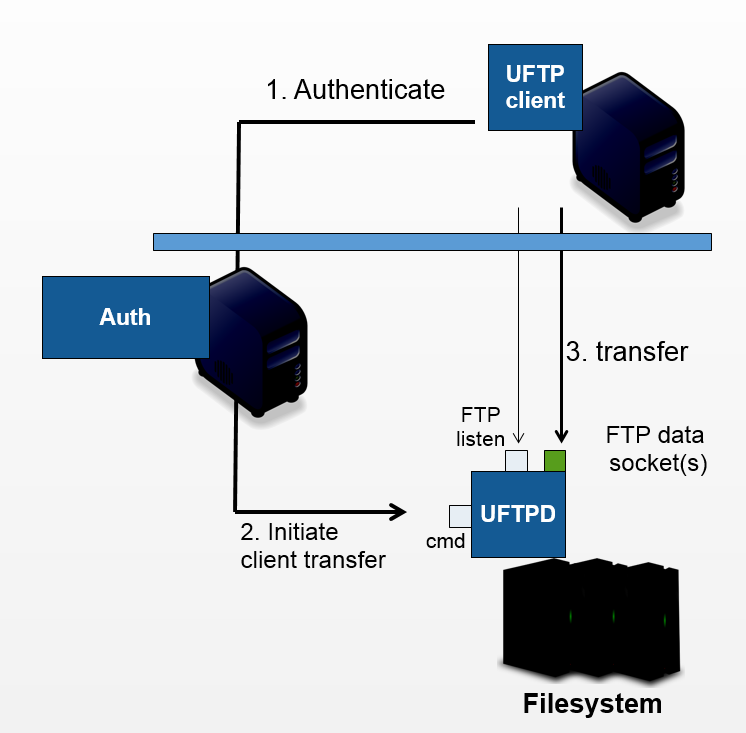

.. _uftp-overview:

|overview-img| UFTP Overview
****************************

.. |overview-img| image:: _static/overview.png
   :height: 32px
   :align: middle

UFTP (**U**\ NICORE **FTP**) is a secure file transfer tool similar to
the Unix FTP utility. It supports high-performance file transfers
between clients and servers, directory browsing, file management,
synchronization, and data sharing. In addition, users can share data
with collaborators who do not have direct Unix-level access to the
underlying file system.

UFTP Features
~~~~~~~~~~~~~

- Based on the FTP protocol with authentication provided via RESTful
  APIs

- Powerful :ref:`UFTP standalone client <uftp-client>` available

- Optional support for multiple FTP sessions per client, as well as
  data-stream encryption and compression

- Flexible integration options (authentication, user mapping) and
  firewall-friendly operation

- System requirements: Java 17+ (Auth server. UFTP client), Python 3 (UFTP server)

UFTP Architecture
~~~~~~~~~~~~~~~~~

The UFTP file server, called :ref:`UFTPD <uftpd>`, listens on two ports
(which may be on two different network interfaces):

- the command port receives transfer control requests from one or more
  authentication servers

- the listen port accepts incoming client FTP control connections

The UFTPD server is *controlled* by an :ref:`authserver` or
:ref:`UNICORE/X <unicore-docs:unicorex>` via the command port, and
transfers file data directly to and from the client (which can be an
end-user client or another server).

The client, e.g. :ref:`uftp-client`, first establishes an FTP control
session by connecting to the listen port, which must be accessible from
external machines. Once authenticated with the one-time password, the
client opens additional FTP data connections as required using passive
FTP.

How does UFTP work
~~~~~~~~~~~~~~~~~~

A typical UFTP session proceeds as follows:

* The client (which can be an end-user client, or a service such as a
  :ref:`UNICORE/X server <unicore-docs:unicorex>`) sends an
  authentication request to the :ref:`Auth server <authserver>` (or
  another UNICORE/X server).

* The Auth server sends a control request to the command port of UFTPD.
  This request prepares the UFTPD server for an upcoming client session
  and contains the following information:

  - a *secret*, i.e. a one-time password that the client uses to
    authenticate itself
  - the user and group IDs that UFTPD should use to access the files
  - an optional encryption key used to encrypt or decrypt the data
  - the client's IP address

* The UFTPD server accepts an incoming client connection on its listen
  port, provided that the supplied *secret* (one-time password) matches
  the expected value.

* If authentication succeeds, an FTP session is established. The client
  can then use the FTP protocol to list files, transfer data, and open
  additional passive FTP data connections as required. UFTPD
  dynamically allocates the required data ports (or a configured port
  range).

* For each UFTP session, UFTPD forks a process that runs as the
  requested user (with the requested primary group).

UFTP Applications and Use Cases
~~~~~~~~~~~~~~~~~~~~~~~~~~~~~~~

* Secure, high-performance file transfer and data access

  * Powerful :ref:`UFTP commandline client <uftp-client>`

* Integrate data access/transfer functionality into web applications

  * RESTful authentication APIs combined with standard FTP-based file
    transfer

* Data sharing in HPC environments

  * Authenticated or anonymous access

* :ref:`UNICORE integration <unicore-integration>`

  * Server-server file transfer and data staging for HPC applications
    and workflows
  * Integrated into UNICORE clients for fast file upload and download
  
.. raw:: html

   
