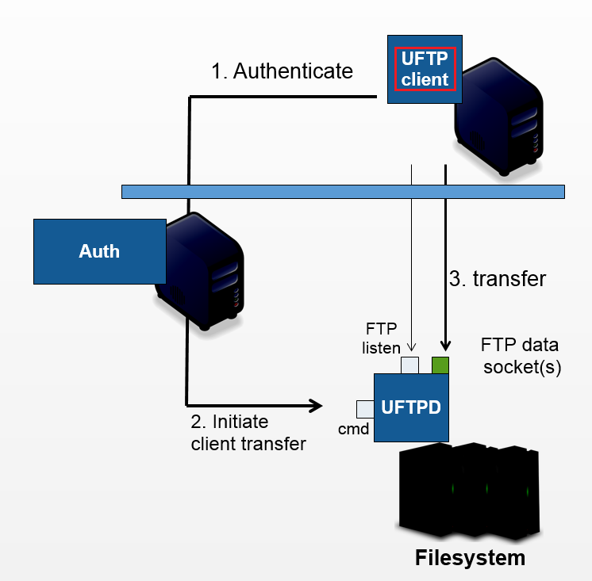

.. _uftp-client:

UFTP client
***********

The UFTP commandline client enables to 

* `list remote directories <manual.html#ls-command>`__ (``ls``)
 
* `upload\/download files <manual.html#cp-command>`__ (``cp``)

* `compute checksums for remote files <manual.html#checksum-command>`__ (``checksum``)

* `sync remote\/local files <manual.html#sync-command>`_ (``sync``)

* make remote directories (``mkdir``)

* delete remote files or directories (``rm``)

* `manage shares and access shared data <manual.html#data-sharing>`__ (``share``, ``get-share``, 
  ``put-share``)

* `perform authentication <manual.html#auth>`__ to help integrate UFTP with other tools 

The UFTP client will connect to an authentication server (either a `UNICORE/X server 
<https://unicore-docs.readthedocs.io/en/latest/admin-docs/unicorex>`_
or the :ref:`authserver`) to authenticate and then to
the :ref:`uftpd` for transferring data or making a file operation.

The UFTP client supports username/password authentication, OIDC
token authentication and ssh-key authentication. 

The UFTP client supports multiple concurrent FTP connections for highly efficient 
data transfers in high-performance environments.

.. topic:: Features

 * :ref:`Commands <uftp-client-basic-usage>` (UNIX-like semantics) 
 
 * Supports `multi-threaded transfers <manual.html#multiple-connections>`__, 
   `encryption and compression <manual.html#encrypt-compress>`__ of the data streams

 * `Flexible authentication <manual.html#auth>`__

   * sshkey incl. support for ssh-agent (on Linux only)
   * OIDC via oidc-agent
   * Username/password

.. topic:: User Documentation

  :doc:`basic-usage`
      Basic usage of the UNICORE Client.

  :doc:`manual`
      User Manual with detailed instructions and examples for using the UNICORE Client.

  :doc:`changelog`
    The UNICORE Client changelog.

.. topic:: Administrator Documentation

  :doc:`building`
      Building the UNICORE Client distribution packages.

.. toctree::
	:maxdepth: 2
	:caption: UFTP Client Documentation
	:hidden:
      
	basic-usage
	manual
	building
	
	
.. toctree::
	:maxdepth: 1
	:hidden:

	changelog   

