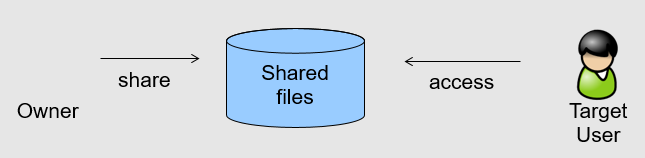

.. _uftp-client-manual:

|user-guide-img| User Manual
============================

.. |user-guide-img| image:: ../../_static/user-guide.png
	:height: 32px
	:align: middle

The UFTP standalone Client is a Java-based commandline client for UFTP. It allows to list 
remote directories, copy files (with many options such as wildcards or multiple threads), 
and more. It can be used with either a :ref:`UFTP Authentication Server <authserver>` or 
a UNICORE server to authenticate and initiate UFTP transfers. 

|settings-img| Installation
---------------------------

Prerequisites
~~~~~~~~~~~~~

* Java 8 or later (OpenJDK preferred)

* Access to a UFTP authentication service (either a `UNICORE/X
  <https://unicore-docs.readthedocs.io/en/latest/admin-docs/unicorex/index.html>`_ server or the 
  :ref:`authserver`) and to the corresponding :ref:`uftpd`. 

To use the client, you need to know the address of the UFTP authentication service. You need also 
to have the valid credentials for the UFTP authentication.

Installation and Configuration
~~~~~~~~~~~~~~~~~~~~~~~~~~~~~~

The UFTP client distribution packages are available at `sourceforge.net  
<https://sourceforge.net/projects/unicore/files/Clients/UFTP-Client>`__. 

If using the ``zip`` or ``tar archive``, unpack it in a location of your choice. Add the ``bin`` 
directory to your path. Alternatively, you can
link or copy the ``bin/uft`` script to a directory that is already on
your path, in this case edit the script and setup the required directories.

If you use the ``rpm`` or ``deb`` package, install it using the package 
manager of your Linux distribution.

.. _auth:

|auth-img| Authentication
-------------------------

By default, the UFTP client will use the current username (``$USER``) with SSH key 
authentication to authenticate to the :ref:`authserver`.

You can set a different default username via the ``UFTP_USER`` environment variable. This is 
useful if your remote username is not the same as your local username.

The UFTP client supports various means of authentication. Depending
on the server you want to access, you can choose from

 * user name with SSH key (default)
 * user name with password
 * `oidc-agent <https://github.com/indigo-dc/oidc-agent>`__
 * manual specification of the HTTP Authorization header value

To explicitely specify the remote username, use the ``-u <username>`` option, e.g.

.. code:: console

	$ uftp ls -u username https://localhost:9000/rest/auth/TEST:/home/demo/

The credentials can be given in multiple ways.

* On the command line ``-u username:password``

  .. code:: console

    $ uftp ls -u username:password ...

* You can tell the uftp client to query the password interactively by giving the ``-P`` option, 
  e.g.

  .. code:: console

	 $ uftp ls -u username -P ...

* If no password is given, the client will attempt to use an SSH key for authentication, this has 
  to be configured on the authentication server accordingly. If you have multiple keys, use the 
  ``-i`` option to select one. Otherwise, the client will check ``~/.uftp/`` and ``~/.ssh/`` for 
  useable keys. The SSH agent is supported, too.

* The very useful `oidc-agent <https://github.com/indigo-dc/oidc-agent>`__ tool is also directly 
  supported via ``-O <account_name>``. In this case no username is required.

  .. code:: console

    $ uftp ls -O hbp ...

* Last not least you can directly specify a value for the HTTP *Authorization* header with
  the ``-A`` option. This allows to use an OIDC bearer token for authorization, e.g.
  ``-A "Bearer <oidc_token>``. In this case no username is required.

  .. code:: console
  
    $ uftp ls -A "Bearer <oidc_token>" ...

|usage-img| Usage
-----------------

In the following usage examples, the authentication service is located
at *localhost:9000/rest/auth/* and the user name is *username*.
Replace these values by the correct ones for your installation.

.. _ls-command:

Listing a directory: the ``ls`` command
~~~~~~~~~~~~~~~~~~~~~~~~~~~~~~~~~~~~~~~

.. code:: console

	$ uftp ls https://localhost:9000/rest/auth/TEST:/home/demo/

will list the */home/demo* directory.

.. _cp-command:

Copying data: the ``cp`` command
~~~~~~~~~~~~~~~~~~~~~~~~~~~~~~~~

The ``cp`` command is used to copy local data to a remote server or vice
versa. Remote locations are indicated by the ``https://`` prefix, and you
need your user name, and the URL of the authentication server.

It has a number of features, which will be shown in the following.

Basic usage
^^^^^^^^^^^

* Downloading a single file:

  .. code:: console

	$ uftp cp https://localhost:9000/rest/auth/TEST:/home/demo/test.data .

  will download the */home/demo/test.data* file to the current directory

* Download files using wildcards:

  .. code:: console

    $ uftp cp https://localhost:9000/rest/auth/TEST:/home/demo/data/* .

  will download all files in the `/home/demo/test` directory to the current directory

Similar commands work for upload.

* Uploading files using wildcards:

  .. code:: console

     $ uftp cp "/data/*" https://localhost:9000/rest/auth/TEST:/home/demo/data/ .

.. note:

The wildcards should be escaped to avoid the shell doing the expansion, which will also work, 
but generally be slower.

The recurse flag, ``-r``, tells uftp to also copy subdirectories.

Piping data
^^^^^^^^^^^

The ``cp`` command can read/write from the console streams, which is great for integrating uftp 
into Unix pipes. The ``-`` is used as a special *file name* to indicate that data should be 
read/written using the console.

Transferring with tar and zip
^^^^^^^^^^^^^^^^^^^^^^^^^^^^^

For example to tar the contents of a directory and upload the tar file using uftp

.. code:: console

	$ tar cz dir/* | uftp cp - https://localhost:9000/rest/auth/TEST:/archive.tgz 

The :ref:`UFTPD server <uftpd>` can also unpack tar and zip streams, this is very useful to 
efficiently transfer many small files. To enable this, add the ``-a`` option, and DO NOT compress 
the tar stream.

.. code:: console

	$ tar c dir/* | uftp cp -a - https://localhost:9000/rest/auth/TEST:/target_location/

or, using ``zip``

.. code:: console

	$ zip -r - dir/* | uftp cp -a - https://localhost:9000/rest/auth/TEST:/target_location/

.. note::
 Zip will compress data, so might be slower or faster than tar, depending on network bandwith 
 and processing speed.

Similarly, ``-`` can be used to write data to standard output.
As an example, consider this

.. code:: console

	$ uftp cp https://localhost:9000/rest/auth/TEST:/archive.tgz - | tar tz

Or use ``uftp`` to cat a remote file

.. code:: console

	$ uftp cp https://localhost:9000/rest/auth/TEST:/foo.txt -

.. _multiple-connections:

Using multiple FTP connections
^^^^^^^^^^^^^^^^^^^^^^^^^^^^^^

When transferring large files (or many files) over a high-performance network, performance
can be vastly improved by using multiple FTP connections. (NOTE this is different from
the multiple TCP streams as set via the ``-n`` option).

Use the ``-t`` option to set the desired number of streams. Note that the server may have
a limit on the allowed number of concurrent connections, if in doubt, ask your server
administrator.

.. code:: console

	$ uftp cp -t 2 https://localhost:9000/rest/auth/TEST:/home/demo/* .

Files larger than a certain size will be transferred concurrently
using more than one stream. This threshold size is 512MB, but you can set it to a
different value using the ``-T`` option. For example, to split files larger than 1MB

.. code:: console

	$ uftp cp -t 2 -T 1M https://localhost:9000/rest/auth/TEST:/home/demo/* .

Byte ranges
^^^^^^^^^^^

To copy just part of a file, a byte range can be given with the ``-B``
option. Counting starts at *zero*. For example to download only the
first 1024 bytes of file (i.e. the byte range 0 - 1023), you would do

.. code:: console

	$ uftp cp -B 0-1023 https://localhost:9000/rest/auth/TEST:/home/demo/test.data .

As an additional feature, you can use the additional ``-p`` flag, which
will write also only the given range. For example

.. code:: console

	$ uftp cp -B 1024-2047-p https://localhost:9000/rest/auth/TEST:/home/demo/test.data .

will write bytes 1024-2047 of the remote file to the local file,
starting at offset 1024. The local file will have length 2048.

The same thing works for remote files!

Number of bytes to transfer
^^^^^^^^^^^^^^^^^^^^^^^^^^^

A simplified version of the byte range specification is to just give
the amount of data to transfer (implying the start of the range is at byte **0**)

This is handy for quick performance tests:

.. code:: console

	$ uftp cp -B 10G https://localhost:9000/rest/auth/TEST:/dev/zero /dev/null

.. _encrypt-compress:

Encryption and compression
^^^^^^^^^^^^^^^^^^^^^^^^^^

The cp command supports the ``-E`` and ``-C`` options, which enable data
encryption and compression (during transfer) respectively. 

* Data encryption uses a symmetric algorithm, which nonetheless
  drastically lowers the performance.

* Data compression uses the gzip algorithm.

Compression and encryption can be combined.

Resuming a failed transfer
^^^^^^^^^^^^^^^^^^^^^^^^^^

If a copy command was terminated prematurely, it can be resumed using
the ``-R`` option.  If the ``-R`` option is present, the UFTP client will
check if the target file exists, and will append only the missing
data.

So if your inital copy operation

.. code:: console

	$ uftp cp -u username https://localhost:9000/rest/auth/TEST:/home/demo/test.data .

did not finish correctly, you can resume it with

.. code:: console

	$ uftp cp -R https://localhost:9000/rest/auth/TEST:/home/demo/test.data .

Performance testing
^^^^^^^^^^^^^^^^^^^

For performance testing, you can use ``/dev/zero`` and ``/dev/null`` as data source ``/`` sink.

For example to transfer 10 gigabytes of zeros from the remote server:

.. code:: console

	$ uftp cp -B 0-10G https://localhost:9000/rest/auth/TEST:/dev/zero /dev/null

This can also be combined with the multi-connection option ``-t``. To use two connections each 
transferring 5 gigabytes

.. code:: console

	$ uftp cp -B 0-10G -t 2 https://localhost:9000/rest/auth/TEST:/dev/zero /dev/null

.. _checksum-command:

Computing checksums for remote files
^^^^^^^^^^^^^^^^^^^^^^^^^^^^^^^^^^^^

To compute a checksum for a remote file, use the ``checksum`` command:

.. code:: console

	$ uftp checksum https://localhost:9000/rest/auth/TEST:/data/*.dat

A number of different hashing algorithms are available, which can be selected
using the ``-a`` option (MD5, SHA-1, SHA-256, SHA-256). For example

.. code:: console

	$ uftp checksum -a SHA-256 https://localhost:9000/rest/auth/TEST:/data/*.dat

.. _sync-command:

Synchronizing a file: the ``sync`` command
^^^^^^^^^^^^^^^^^^^^^^^^^^^^^^^^^^^^^^^^^^

Note that ``sync`` only supports single files, i.e. no directories or wildcards!
The syntax is

.. code:: console

	$ uftp sync <master> <slave>

For example, to synchronize a local file with a remote *master* file:

.. code:: console

	$ uftp sync https://localhost:9000/rest/auth/TEST:/master.file local.file

To synchronize a remote file with a local *master* file:

.. code:: console

	$ uftp sync master.file https://localhost:9000/rest/auth/TEST:/remote.file

.. _data-sharing:

Data sharing
~~~~~~~~~~~~

Data sharing enables users to create access to their datasets for
other users via UFTP, even if those users do not have Unix-level
access to the data.

Data sharing works as follows:

* when you share a file (or directory), the :ref:`authserver` will store information 
  about the path, the owner and the Unix user ID used to access the file in a database
  
* the targetted user can now access this file via the :ref:`authserver`, and the Auth 
  server will use the owner's Unix user ID to access the file.

By default, files will be shared for *anonymous* access. This will
allow anyone who knows the sharing link to access the file using
normal HTTP tools like ``wget`` or ``curl``.

Shares can also be limited to certain users.

Depending on the type of share, access to the files is possible with
the UFTP protocol or plain HTTPs.

Shares can be deleted by their owner, i.e. the user who created them.

.. note::
	Not all UFTP installations support data sharing.  You can check if a server has 
	the sharing feature enabled by running ``uftp info --server ...``

Server URL
^^^^^^^^^^

If not given via the ``--server`` argument, the URL of the :ref:`authserver` will 
be taken from the environment variable ``UFTP_SHARE_URL``

.. code:: console

	$ export UFTP_SHARE_URL=https://localhost:9000/rest/share/TEST
	$ uftp share --list

Listing shares
^^^^^^^^^^^^^^

.. code:: console

	$ uftp share --list --server https://localhost:9000/rest/share/TEST

The output will show both the files you have shared, as well as files that other
users have shared with you.

Creating or updating a share
^^^^^^^^^^^^^^^^^^^^^^^^^^^^

A share consists of a server-side path, (optional) write permissions
and (optional) target user.

To share a file,

.. code:: console

	$ uftp share  \
		--server https://localhost:9000/rest/share/TEST  \
		/data/public/somefile.pdf

If you use a relative path, ``uftp`` will make it absolute.

.. code:: console

	$ pwd
	> /data/public/
	$ uftp share somefile.pdf

will share the path */data/public/somefile.pdf*.

You can use the following options to modify the defaults:

  * ``--access <user-identifier>`` to limit access to the specified user(s)
  * ``--write`` for write acces
  * ``--delete`` to delete a share

For example to share */data/public/somefile.pdf* with the user *CN=User*

.. code:: console

	$ uftp share  \
		--server https://localhost:9000/rest/share/TEST  \
		--access "CN=User"  \
		/data/public/somefile.pdf

Shares can have a limited lifetime via the ``--lifetime <seconds>`` option.

Shares can also be limited to a single access via the ``--one-time`` option.

Deleting shares
^^^^^^^^^^^^^^^

To delete you need the path and the target user, which you can get via the 
``uftp share --list`` command.

.. code:: console

	$ uftp share  \
		--delete  \
		--server https://localhost:9000/rest/share/TEST  \
		--access "CN=User"  \
		/data/public/somefile.pdf

Anonymous (https) access
^^^^^^^^^^^^^^^^^^^^^^^^

For anonymous access via HTTP you need to use the correct URL. If you create (or list) shares,
the UFTP client will show the required links. You can download the file e.g. using `wget 
<https://www.gnu.org/software/wget/>`_.

In case the share is a directory, wget will return a directory listing.

Downloading shared data using the UFTP protocol
^^^^^^^^^^^^^^^^^^^^^^^^^^^^^^^^^^^^^^^^^^^^^^^

It's possible to use the UFTP protocol to access shared data.

This can be also done anonymously by specifying "-u anonymous" on the uftp commandline.

The correct URLs for accessing shares via UFTP can see in the 'uftp' field
of the output of the ``--list`` command.

To download a single shared file, use the ``get-share`` command 

.. code:: console

	$ uftp get-share https://localhost:9000/rest/access/TEST:/data/public/somefile.pdf

In case the share is a directory, the standard ``uftp ls`` and ``uftp cp`` commands
will work, too.

.. code:: console

	$ uftp ls https://localhost:9000/rest/access/TEST:/data/public/

	$ uftp cp https://localhost:9000/rest/access/TEST:/data/public/somefile.pdf ./downloaded.pdf

Uploading to a share using the UFTP protocol
^^^^^^^^^^^^^^^^^^^^^^^^^^^^^^^^^^^^^^^^^^^^

To upload a file to a location (file or directory) that has been
shared with you, use the ``put-share`` command

.. code:: console

	$ uftp put-share data/*.pdf https://localhost:9000/rest/access/TEST:/data/public/

.. _rcp-command:

Server-to-server copy: the ``rcp`` command (EXPERIMENTAL)
~~~~~~~~~~~~~~~~~~~~~~~~~~~~~~~~~~~~~~~~~~~~~~~~~~~~~~~~~

REQUIRES UFTPD 3.2.0 or later (at least on one side)

The ``rcp`` command is used to instruct a remote UFTPD server
to copy data from another UFTPD server. The client authenticates to both sides.

Basic usage
^^^^^^^^^^^

The basic syntax is similar to the normal ``uftp cp`` command:

.. code:: console

	$ uftp rcp <options> <source1> ... <sourceN> <target>

If the same means of authentication can be used for both source and target sides,
both source and target are normal UFTP URLs. If source and target require different
authentication, you need to use the ``uftp auth`` command first to authenticate to
the one side (usually the source)

.. code:: console

	$ uftp auth <options> <source1>

and give the resulting host:port and one-time password to the rcp command via
commandline options:

.. code:: console

	$ uftp rcp --server <host:port> --one-time-password <pwd> <source1> <target>

Other supported features
^^^^^^^^^^^^^^^^^^^^^^^^

The ``rcp`` command supports byte ranges via the ``-B`` option.

Reversing the copy direction
^^^^^^^^^^^^^^^^^^^^^^^^^^^^

By default, the target side is instructed to download data from the source side.
This can be reversed, if necessary, for example if only the source supports
server-to-server copy. To do this, an environment variable can be set:

.. code:: console

	$ export UFTP_RCP_USE_SEND_FILE=true
	$ uftp rcp ...

This will result in the source side uploading the file to the target side, and
the ``--server`` and ``--one-time-password`` options will refer to the target side.

Known issues
^^^^^^^^^^^^

There is no way to monitor or abort a running server-to-server transfer
from the client.

Wildcards are not supported.

Using a proxy server (EXPERIMENTAL)
-------------------------------------

The uftp client has support for some types of FTP and HTTPs proxies. 

This is configured via enviroment settings. I.e. in your shell you can define

* FTP proxy
  ::

	export UFTP_PROXY=proxy.yourorg.edu
	export UFTP_PROXY_PORT=21

* HTTP proxy
  ::

	export UFTP_HTTP_PROXY=proxy.yourorg.edu
	export UFTP_HTTP_PROXY_PORT=80

FTP proxying was tested with the DeleGate/9.9.13 and frox proxies
and requires :ref:`UFTPD server <uftpd>` version 2.8.1 or later to work.

If this does not work for you, or if you require support for a
different type of proxy, please contact us via a |ticket-img| `support ticket 
<https://sourceforge.net/p/unicore/uftp-issues/>`_ or via |email-img|
`email <unicore-support@lists.sf.net>`_.

|support-img| Troubleshooting 
-------------------------------------

|:man_shrugging:| **How can I get more detailed logging?** 

	|:point_right:| In the client\'s **conf** directory you\'ll find a ``logging.properties`` 
	file that allows you to increase the log levels.

|:man_shrugging:| **I get "Invalid server response 500" and "Exception.... Authentication 
failure"**

	|:point_right:| Probably you gave a wrong username or password. Contact your site 
	administrator if in doubt! If using a password, make sure you give the ``-P`` flag.

|:man_shrugging:| **I get "Invalid server response 405 Unable to connect to server for listing"**

	|:point_right:| Check the remote URL that you use. Maybe you have a typo in the 
	``/rest/auth/<servername>`` part.
